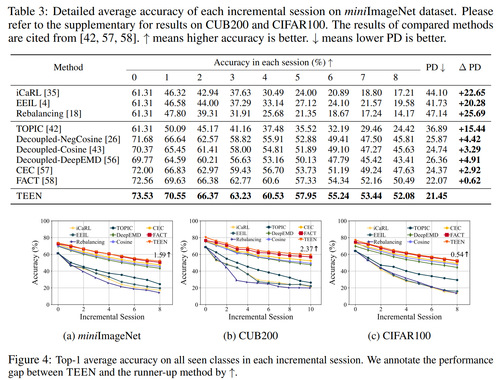

# Few-Shot Class-Incremental Learning via Training-Free Prototype Calibration (TEEN)

The code repository for "Few-Shot Class-Incremental Learning via Training-Free Prototype Calibration" [[paper]](https://arxiv.org/abs/2312.05229) (NeurIPS'23) in PyTorch. If you use any content of this repo for your work, please cite the following bib entry:

    @inproceedings{
        wang2023teen,
        title={Few-Shot Class-Incremental Learning via Training-Free Prototype Calibration},
        author={Wang, Qi-Wei and Zhou, Da-Wei and Zhang, Yi-Kai and Zhan, De-Chuan, and Ye, Han-Jia},
        booktitle={NeurIPS},
        year={2023}
    }

## Few-Shot Class-Incremental Learning via Training-Free Prototype Calibration

Real-world scenarios are usually accompanied by continuously appearing classes with scarce labeled samples, which require the machine learning model to incrementally learn new classes and maintain the knowledge of base classes. In this Few-Shot Class-Incremental Learning (FSCIL) scenario, existing methods either introduce extra learnable components or rely on a frozen feature extractor to mitigate catastrophic forgetting and overfitting problems. However, we find a tendency for existing methods to misclassify the samples of new classes into base classes, which leads to the poor performance of new classes. In other words, the strong discriminability of base classes distracts the classification of new classes. To figure out this intriguing phenomenon, we observe that although the feature extractor is only trained on base classes, it can surprisingly represent the semantic
similarity between the base and unseen new classes. Building upon these analyses, we propose a simple yet effective Training-frEE calibratioN (TEEN) strategy to enhance the discriminability of new classes by fusing the new prototypes (i.e., mean features of a class) with weighted base prototypes. In addition to standard benchmarks in FSCIL, TEEN demonstrates remarkable performance and consis- tent improvements over baseline methods in the few-shot learning scenario. 

## Results

Please refer to our [paper](https://arxiv.org/abs/2312.05229) for detailed values.

## Prerequisites

The following packages are required to run the scripts:

- [PyTorch-1.4 and torchvision](https://pytorch.org)

- tqdm

## Dataset
We provide the source code on three benchmark datasets, i.e., CIFAR100, CUB200 and miniImageNet. Please follow the guidelines in [CEC](https://github.com/icoz69/CEC-CVPR2021) to prepare them.

## Code Structures and details
There are four parts in the code.
 - `models`: It contains the backbone network and training protocols for the experiment.
 - `data`: Images and splits for the data sets.
 - `dataloader`: Dataloader of different datasets.

## Training scripts

Please see `scripts` folder.

## Acknowledgment
We thank the following repos providing helpful components/functions in our work.

- [Awesome Few-Shot Class-Incremental Learning](https://github.com/zhoudw-zdw/Awesome-Few-Shot-Class-Incremental-Learning)
- [PyCIL: A Python Toolbox for Class-Incremental Learning](https://github.com/G-U-N/PyCIL)
- [CEC](https://github.com/icoz69/CEC-CVPR2021)
- [FACT](https://github.com/zhoudw-zdw/CVPR22-Fact)

## Contact 
If there are any questions, please feel free to contact with the author: Qi-Wei Wang (wangqiwei@lamda.nju.edu.cn). Enjoy the code.